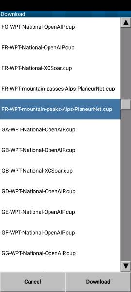

[](https://github.com/planeur-net/outlanding)
# Outlanding
The data and information provided in this repository is for information use only. In no way could the authors or the land-owners be liable in case of accident.
## Download
| File  | Format  | Link | Comment | Auto. Gen. | [Download from ](#download-depuis-xcsoar)|
|---|---|---|---|---|---|
| Outlanding sites booklet | cup | [guide_aires_securite.cup](https://planeur-net.github.io/outlanding/guide_aires_securite.cup) | | :pencil2: | :heavy_check_mark: [FR-WPT-...](## "FR-WPT-guide-des-aires-de-securite-Alps.cup") |
| | cupx | [guide_aires_securite.cupx](https://planeur-net.github.io/outlanding/guide_aires_securite.cupx) | | :heavy_check_mark:
| | kml | [guide_aires_securite.kml](https://planeur-net.github.io/outlanding/guide_aires_securite.kml) | | :heavy_check_mark:
| | kmz | [guide_aires_securite.kmz](https://planeur-net.github.io/outlanding/guide_aires_securite.kmz) | | :heavy_check_mark:
| | gpx | [guide_aires_securite.gpx](https://planeur-net.github.io/outlanding/guide_aires_securite.gpx) | | :heavy_check_mark:
| | _details.txt | [guide_aires_securite_details.txt](https://planeur-net.github.io/outlanding/guide_aires_securite_details.txt) | XCSoar: Image description | :heavy_check_mark:
| | | [combined_guide+champs_details.txt](https://planeur-net.github.io/outlanding/combined_guide+champs_details.txt) | XCSoar: Booklet + Outlanding fields | :heavy_check_mark:
| | zip | [guide_aires_securite.xcsoar.zip](https://planeur-net.github.io/outlanding/guide_aires_securite.xcsoar.zip) | [XCSoar: All necessary files](doc/xcsoar_waypoint_details.md) |:heavy_check_mark:
| | | [combined_guide+champs.xcsoar.zip](https://planeur-net.github.io/outlanding/combined_guide+champs.xcsoar.zip) | XCSoar: Booklet + Outlanding fields | :heavy_check_mark:
||||
| Champs des Alpes | cup | [champs_des_alpes.cup](https://planeur-net.github.io/outlanding/champs_des_alpes.cup) | | :pencil2: |
| | cupx | [champs_des_alpes.cupx](https://planeur-net.github.io/outlanding/champs_des_alpes.cupx) | | :heavy_check_mark:
||||
| Cols des Alpes | cup | [cols_des_alpes.cup](https://planeur-net.github.io/outlanding/cols_des_alpes.cup) | | :pencil2: | :heavy_check_mark: [FR-WPT-...](## "FR-WPT-mountain-passes-Alps-PlaneurNet.cup") |
| | cupx | [cols_des_alpes.cupx](https://planeur-net.github.io/outlanding/cols_des_alpes.cupx) | | :heavy_check_mark:
| | kml| [cols_des_alpes.kml](https://planeur-net.github.io/outlanding/cols_des_alpes.kml) | | :heavy_check_mark:
| | kmz| [cols_des_alpes.kmz](https://planeur-net.github.io/outlanding/cols_des_alpes.kmz) | | :heavy_check_mark:
||||
| Montagnes des Alpes | cup | [mountain_peaks_FR.cup](https://planeur-net.github.io/outlanding/mountain_peaks_FR.cup) | France | :pencil2: | :heavy_check_mark: [FR-WPT-...](## "FR-WPT-mountain-peaks-Alps-PlaneurNet.cup") |
| | |  [mountain_peaks_CH.cup](https://planeur-net.github.io/outlanding/mountain_peaks_CH.cup) | Suisse | :pencil2: | :heavy_check_mark: [CH-WPT-...](## "CH-WPT-mountain-peaks-Alps-PlaneurNet.cup") |
| | |  [mountain_peaks_IT.cup](https://planeur-net.github.io/outlanding/mountain_peaks_IT.cup) | Italie | :pencil2: | :heavy_check_mark: [IT-WPT-...](## "IT-WPT-mountain-peaks-Alps-PlaneurNet.cup") |
| | |  [mountain_peaks_FR_CH_IT.cup](https://planeur-net.github.io/outlanding/mountain_peaks_FR_CH_IT.cup) | France + Switzerland + Italy | :heavy_check_mark:
| | |  [mountain_peaks_Pyrenees.cup](https://planeur-net.github.io/outlanding/mountain_peaks_Pyrenees.cup) | Pyrenees | :pencil2: |

### Update files on an Android Device
<table>
<tr>
<td width=80%>  

An Android application [GithubDownloader](https://github.com/llauner/AirspaceDownloader) allows you to update the files in 1 click.
 Repo github: https://github.com/llauner/AirspaceDownloader  
 .apk file: [com.llcs.airspacedownloader.apk](https://github.com/llauner/AirspaceDownloader/releases)

</td>
<td>

</td>
</tr>
</table>

## Files for outlanding sites  in the Alps
| File  | Comment  |
|---|---|
|Guide des Aires de securite|  Digital version of the "Guide to outlanding areas in the Alps[Reliability: good].
| Champs des Alpes | Other outlanding fields as provided by contributors  [Reliability: medium]
|Cols des Alpes | Mountain passes in the Alps
|mountain_peaks_ | Mountain peaks in France, Switzerland, Italy and Austria. Source: [blog.zirbitzkogel.at](http://zirbitzkogel.at/blog/en/2021/06/04/peaks-mountain-peaks-in-seeyou-cup-format-for-xcsoar/)


### Formats: the following formats are maintained
- .cup : The source file. [SeeYou cup file format](./doc/SeeYou_CUP_file_format.pdf)
- .cupx : Automatically generated from the .cup file and the /Pics folder. [SeeYou cupx file format](./doc/SeeYou_cupx_file_format.md)
- .kml + .kmz : Google Earth format. Automatically generated from the .cup file
- [XCSoar _details.txt](#fichier-_detailstxt-pour-xcsoar): Automatically generated.
- [guide_aires_securite.xcsoar.zip](#fichier-_detailstxt-pour-xcsoar): Automatically generated. Contains files to be copied into the XCSoar files folder: Outlanding sites.
- [combined_guide+champs.xcsoar.zip](#fichier-_detailstxt-pour-xcsoar): Automatically generated. Contains files to be copied into the XCSoar files folder: Outlanding sites + Outlanding fields.
  
[](doc/images/kmz_googlemap_view.png)

### Download from XCSaor
In the above table, files marked with a :heavy_check_mark: in the  column can be downloaded directly grom XCSoar.



### _details.txt file for XCSoar
Automatically generated file:  
The file *guide_aires_securite_details.txt* + the *Pics* directory allow to link a point to an image. 
See installation guide: [xcsoar_waypoint_details.md](doc/xcsoar_waypoint_details.md)    
  
 

### Naming convention
The outlanding site booklet version is mentioned on the 2nd line of the .cup file, inside the code column.
```
"version=",4.2,,,,,,,,,,"c0007a7 2023-12-15T13:59:33+01:00",,
```
#<page_number> <airfield_name>: Airfield. The ICAO name of the airfield.  
```
"#60 LFLG Grenoble Versoud",LFLG,FR,4513.150N,00550.950E,220.0m,5,40,890.0m,,"121.000",,,"N090E005LFLG.jpg"
```

<fied_number> <field_name>: The field number as indicated in colored rectangle in the upper left (or right) corner of the page in the outlanding sites booklet.
```
"213 Aups",V13,FR,4337.517N,00610.983E,450.0m,3,0,300.0m,,,"Zone cultures",,
```

#### Comments
Comments are mainly comming from the booklet. At the end of the comments, a "tag" is added to indicate the difficuly of the field.
Tags are:
| Tag  | Comment  | Colour in the booklet | kmz icon|
|---|---|---|---|
|  {aerodrome} |Airfield or Airport  | White | |
|  {terrain} | Private airfield with markings, or UL airfield | White | |
|  {altiport} | Moutain Airfield | White | |
|  {velisurface} | Velisurface |  | |
|  {facile} | Field with no particular difficulty. Suitable to all glider types  | Green | |
|  {normal} | Field with one or several difficulties (Unique direction, short lenght, ...) | Orange | |
|  {difficile} | Difficult field. Potentialy not ussable by long wingspan gliders  | Red | | 
|  {tres_difficile} | Very difficult field. To be used in case of emergency only. High risk of accident  | Black | |
|||||
|  {col} | Mountain peak  |  | |
| #landmark | Well known Moutain or mountain pass. Name of the mountain could be a local glider pilot name

## Auto generated reports
[doc-reports/](doc-reports/) contains auto generated files. 
| Tool | Comment | Files |
| --- | --- | --- |
| [WaypointProcessor](/src/WaypointProcessor/) | Check altitude with [IGN API](https://geoservices.ign.fr/documentation/services/api-et-services-ogc/calcul-altimetrique-rest#1870) | Altitude_Check-*.md |
| [VerifAlti](/bin) | Check altitudes against a Terrain file | Altitude_Check-VerifAlti-*.md |
 

## Copyrights
Pictures provided and used with permission from Jérémie Badaroux.  
Initial Mountain peaks files by: Dr.-Ing. Stefan V. Baumgartner: [blog.zirbitzkogel.at](http://zirbitzkogel.at/blog/en/2021/06/04/peaks-mountain-peaks-in-seeyou-cup-format-for-xcsoar/)   
[XCSoar-data-content](https://github.com/XCSoar/xcsoar-data-content) for the direct download from XCSoar
Marc Till : VerifAlti = Tool to check altitudes compared top a Terrain file.
