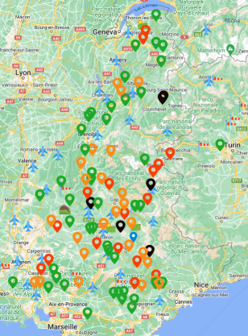
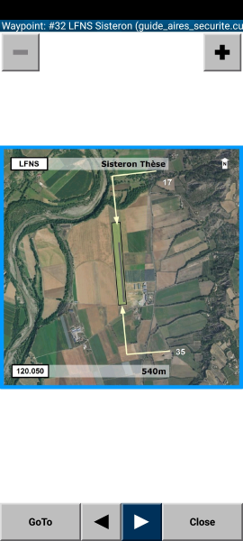
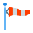
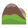

# Outlanding
Les renseignements fournis le sont a titre indicatif et ne sauraient engager la responsabilité des contributeurs et encore moins celle des propriétaires des champs.
## Download
| Fichier  | Format  | Lien | Commentaire |
|---|---|---|---|
| Guide des Aires de securite | cup | [guide_aires_securite.cup](https://planeur-net.github.io/outlanding/guide_aires_securite.cup) 
| | cupx | [guide_aires_securite.cupx](https://planeur-net.github.io/outlanding/guide_aires_securite.cupx)  
| | kml | [guide_aires_securite.kml](https://planeur-net.github.io/outlanding/guide_aires_securite.kml) 
| | kmz | [guide_aires_securite.kmz](https://planeur-net.github.io/outlanding/guide_aires_securite.kmz)
| | _details.txt | [guide_aires_securite_details.txt](https://planeur-net.github.io/outlanding/guide_aires_securite_details.txt) | XCSoar:  Fichier description des images
| | zip | [guide_aires_securite.xcsoar.zip](https://planeur-net.github.io/outlanding/guide_aires_securite.xcsoar.zip) | XCSoar: Contient tous les fichiers nécessaires pour XCSoar. Voir l'aide a l'installation: [xcsoar_waypoint_details.md](doc/xcsoar_waypoint_details.md)    
||||
| Champs des Alpes | cup | [champs_des_alpes.cup](https://planeur-net.github.io/outlanding/champs_des_alpes.cup)
| | cupx | [champs_des_alpes.cupx](https://planeur-net.github.io/outlanding/champs_des_alpes.cupx)
||||
| Cols des Alpes | cup | [cols_des_alpes.cup](https://planeur-net.github.io/outlanding/cols_des_alpes.cup)
| | cupx | [cols_des_alpes.cupx](https://planeur-net.github.io/outlanding/cols_des_alpes.cupx)
| | kml| [cols_des_alpes.kml](https://planeur-net.github.io/outlanding/cols_des_alpes.kml)
| | kmz| [cols_des_alpes.kmz](https://planeur-net.github.io/outlanding/cols_des_alpes.kmz)
||||
| Montagnes des Alpes | cup | [montagnes_des_alpes.cup](https://planeur-net.github.io/outlanding/montagnes_des_alpes.cup) 

### Mise a jour des fichiers sur Android
<table>
<tr>
<td width=80%>  

Une application Android [GithubDownloader](https://github.com/llauner/AirspaceDownloader) permet de mettre a jours les fichiers dans les bons repertoires pour XCSoar ou SeeYou Navigator en 1 click.  
 Le repo github: https://github.com/llauner/AirspaceDownloader  
 Le fichier .apk: [com.llcs.airspacedownloader.apk](https://github.com/llauner/AirspaceDownloader/releases)

</td>
<td>

</td>
</tr>
</table>


## Fichiers de champs "vachables" pour les Alpes
| Fichier  | Commentaire  |
|---|---|
|Guide des Aires de securite| Reprend les aerodromes et champs définis dans le Guide des aires de sécurité dans les Alpes Edition 4.1 Peut cependant contenir des differences liées aux corrections apportées par les contributeurs (altitude, position exacte, ...). [Fiabilité: bonne].
| Champs des Alpes | Autres champs définis par des contributeurs. [Fiabilité: moyenne]
|Cols des Alpes | Cols intéressants dans les Alpes
|Montagnes des Alpes | Noms de montagnes dans les Alpes. :warning: Certains noms peuvent être erronés ou fantaisistes. Merci de participer aux corrections. (Source initiale du fichier a retrouver...)


### Les formats suivants sont maintenus:
- .cup : Le fichier source
- .cupx : Fichier généré automatiquement a partir du .cup et du repertoire /Pics [See: SeeYou cupx file format](./doc/SeeYou_cupx_file_format.md)
- .kml + .kmz : Format Google Earth. Fichier générés automatiquement a partir du .cup
- [XCSoar _details.txt](#fichier-_detailstxt-pour-xcsoar): Fichier généré automatiquement
- [guide_aires_securite.xcsoar.zip](#fichier-_detailstxt-pour-xcsoar): Fichier généré automatiquement. Contient les fichiers a copier dans le repertoire XCSoar pour le Guide des Aires de Securite.  
  
[](doc/images/kmz_googlemap_view.png)

### Fichier _details.txt pour XCSoar
Fichier généré automatiquement:  
Le fichier *guide_aires_securite_details.txt* ainsi que le repertoire *Pics* permettent d'associer une image a un point (champ, aerodrome, ...).  
Voir l'aide a l'installation: [xcsoar_waypoint_details.md](doc/xcsoar_waypoint_details.md)    
  
 

### Guide de nommage
La version du guide de reference est indiquée dans la 2e ligne du fichier cup, dans la colonne code.
```
"version=",4.1,,,,,,,,,,"c0007a7 2023-12-15T13:59:33+01:00",,
```
#<num_page> <nom_aero>: Aerodrome. Le code est le code OACI de l'aerodrome  
```
"#60 LFLG Grenoble Versoud",LFLG,FR,4513.150N,00550.950E,220.0m,5,40,890.0m,,"121.000",,,"N090E005LFLG.jpg"
```

<numero_champs> <nom_champs>: Le numero du champs correspond au numero dans le rectangle colore en haut a gauche (ou droite) de la page du champs dans le guide. 
```
"213 Aups",V13,FR,4337.517N,00610.983E,450.0m,3,0,300.0m,,,"Zone cultures",,
```

#### Commentaires
Les commentaires proviennent généralement du guide. A la fin de chaque commentaire est ajoute un "tag" qui permet d’identifier rapidement la difficulté associée.  
Les "tag" sont:
| Tag  | Commentaire  | Couleur dans le guide | kmz icon|
|---|---|---|---|
|  {aerodrome} | Aerodrome ou aéroport  | blanc | |
|  {terrain} | Terrain balise (prive) ou piste ULM | blanc | |
|  {altiport} | Altiport | blanc | |
|  {velisurface} | Velisurface |  | |
|  {facile} | Champ sans difficulté particulière. Adapte a tous les types de machines  | Vert | |
|  {normal} | Champ avec une ou plusieurs difficultés. (Un seul sens, taille réduite, ...) | Orange | |
|  {difficile} | Champ difficile. Pas forcement utilisable avec les grandes plumes, casse possible, ...  | Rouge | | 
|  {tres_difficile} | Champ tres difficile, a utiliser qu'en ultime recours, casse probable...  | Noir | |
|||||
|  {col} | Col de montagne  |  | |

## Copyrights - Droits
Images fournies et utilisées avec l'autorisation de Jérémie Badaroux.