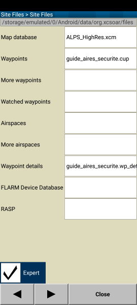

# Fichier Details pour XCSoar
Comme indiqué dans la documention:  
>Les fichiers de détails des aérodromes/points de virage sont de simples fichiers textes (extension.txt) comportant une entrée pour chaque aérodrome, écrit entre crochets et en majuscules, suivi du texte affiché dans la fenêtre d’information des aérodromes/points de virage.

Il permet d'associer une image a un point et de visualiser cette image dans la page des details de ce point.

# Installation

## Méthode 1: fichier par fichier
- Copier le fichier *guide_aires_securite.cup* dans le repertoire fichiers externes de XCSoar= la ou se trouvent déjà vos fichiers (airspace, waypoint, ...)  
`/XCSoarData` ou `/Android/data/org.xcsoar/files`
- Copier dans ce repertoire le repertoire des images `/Pics`
- Copier dans ce repertoire le fichier `guide_aires_securite_details.txt`

- Dans XCSoar: Config/System/Site Files/Site Files sélectionner le fichier *guide_aires_securite.cup* pour Waypoints et *guide_aires_securite_details.txt* pour Waypoint details.  

## Méthode 2: zip
- Télécharger le fichier [guide_aires_securite.xcsoar.zip](https://planeur-net.github.io/outlanding/guide_aires_securite.xcsoar.zip) 
- Copier le contenu du zip dans le repertoire fichiers externes de XCSoar= la ou se trouvent déjà vos fichiers (airspace, waypoint, ...)  

- Dans XCSoar: Config/System/Site Files/Site Files sélectionner le fichier *guide_aires_securite.cup* pour Waypoints et *guide_aires_securite_details.txt* pour Waypoint details.  
  
  

# Waypoint details et images
  Lorsque vous sélectionnez un point, et naviguez dans les details, vous pouvez maintenant voir l'image associée.

 